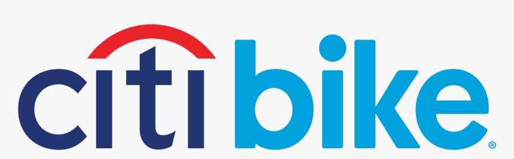
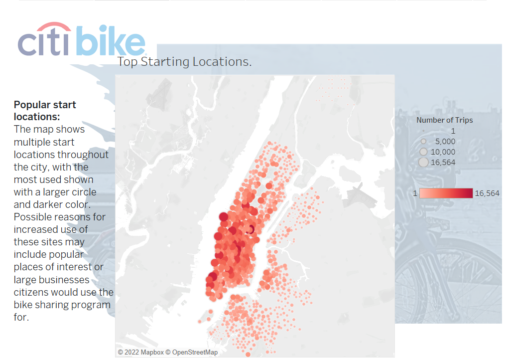

  
# Overview
After traveling to NYC and using their wonderful citiBike program, we would like to propose possible implementation in Des Moines for the public benefit and use. Following is an analysis using data from NYC citiBike program for August of 2019. We will explore popular times and locations and breakdown the data by gender, age, and subscription status and how it could benefit Des Moines.

# Results
Full analysis can be found in the website below

[CitiBike Analysis Page](https://public.tableau.com/app/profile/rafael.arreaza/viz/citiBike_Analysis/citiBikeAnalysis?publish=yes/)

# High Points
## Popular start locations:

  

- Popular start locations could be found around tourist attractions or other forms of mass transit.

