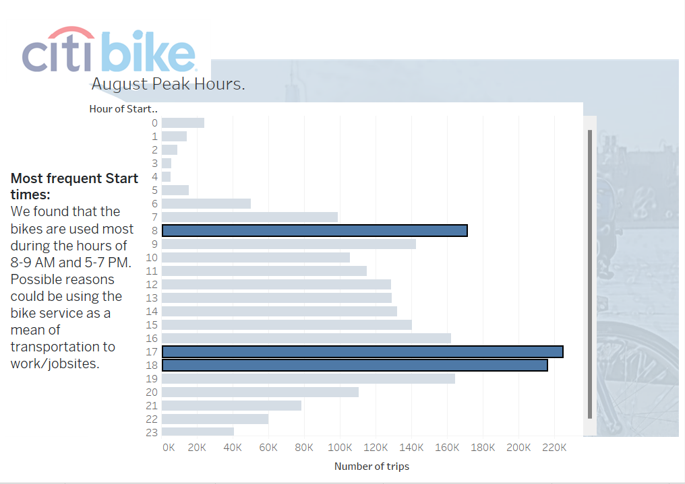
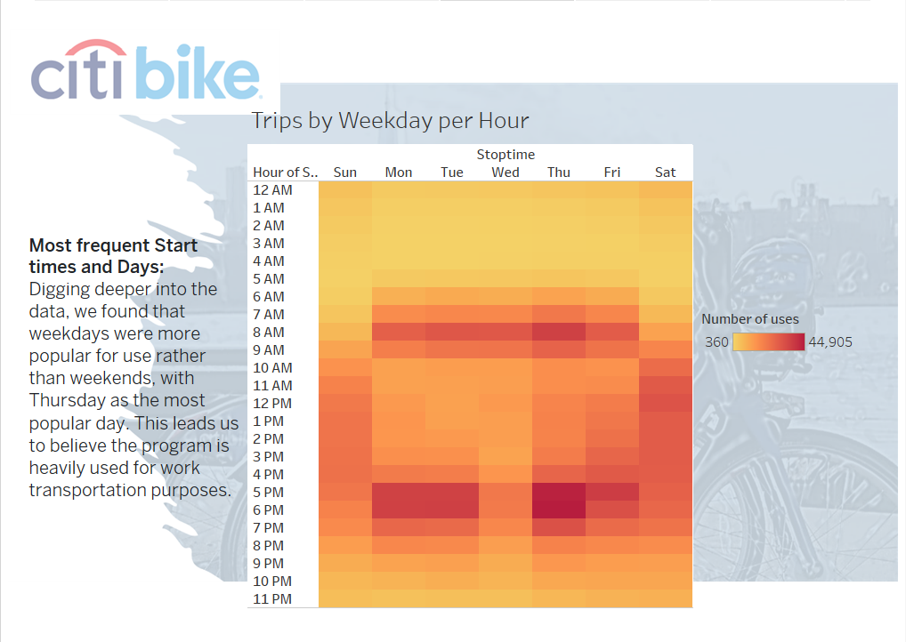
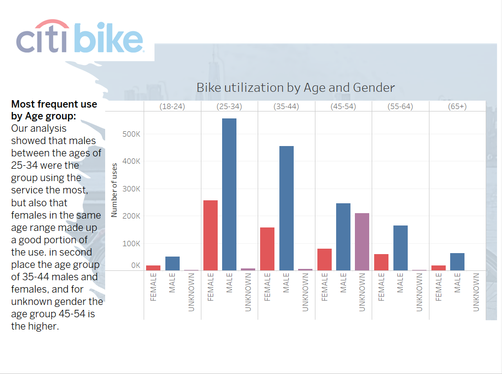
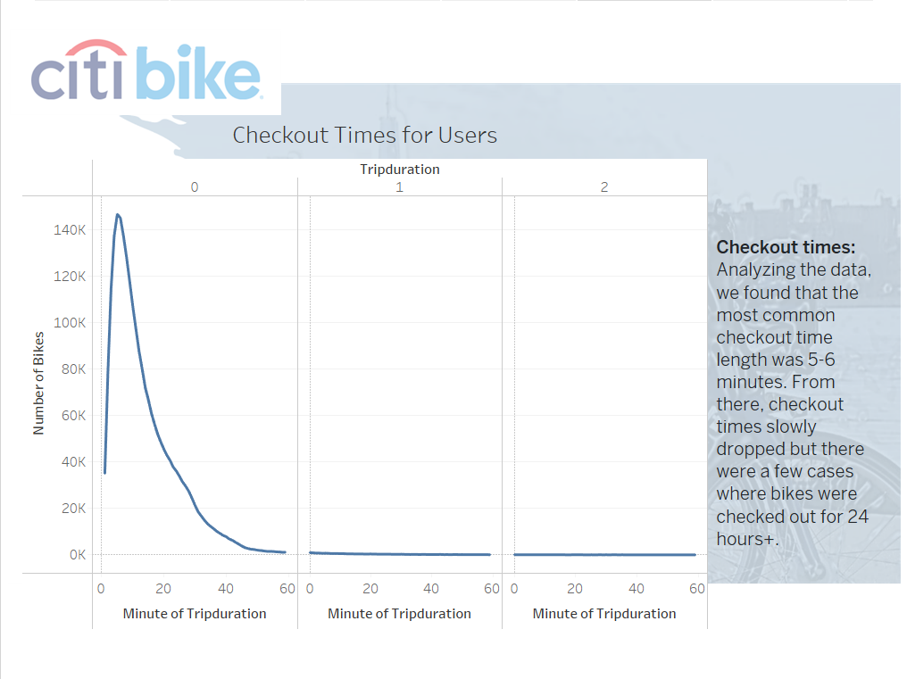
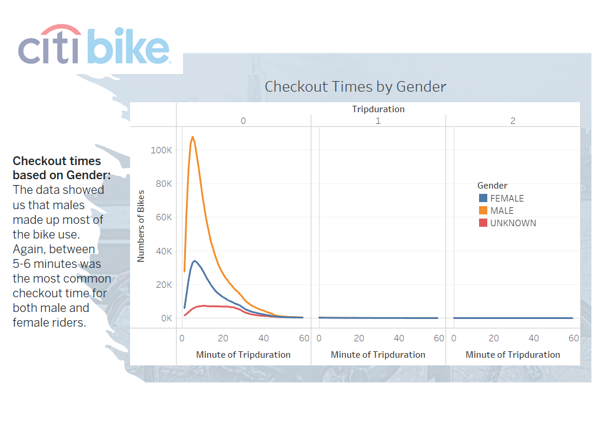
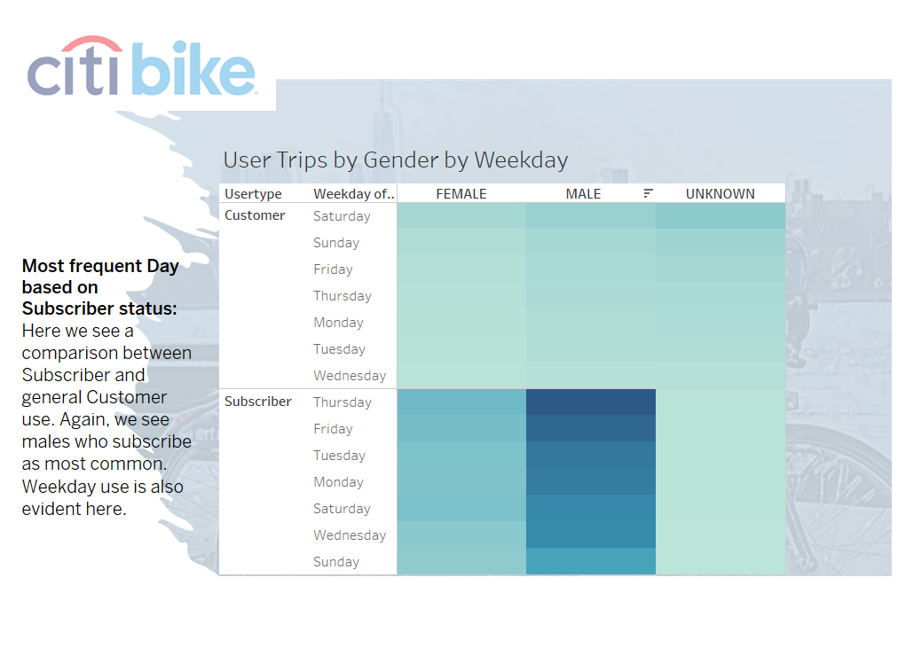

  
# Overview
After traveling to NYC and using their wonderful citiBike program, we would like to propose possible implementation in Des Moines for the public benefit and use. Following is an analysis using data from NYC citiBike program for August of 2019. We will explore popular times and locations and breakdown the data by gender, age, and subscription status and how it could benefit Des Moines.

# Results
Full analysis can be found in the website below

[CitiBike Analysis Page](https://public.tableau.com/app/profile/rafael.arreaza/viz/citiBike_Analysis/citiBikeAnalysis?publish=yes/)

# High Points
## Popular start locations:

  

*  Popular start locations could be found around tourist attractions or other forms of mass transit.

## Start times and Days:

  

  
* Analysis shows most used times gravitate around work commute hours, mainly on weekdays.

## Age and Gender Use

 

* Analysis shows Males ages between 25-44 as highest users, followed by Females ages between 25-34 and 45-54 as second highest.

## Checkout times/Gender

 

 

* Average checkout time 5-6 minutes.

## Subscriber/Customer

 
- Subscriber use outweighs Customer use.

# Summary
Based on the data, our analysis showed the bikes were most used by males, ages 25-34 with heavy use on weekdays during work commuting hours. This would make one to believe the bikes are used as a mode of transportation to and from work for some people. Without further analysis though, that is only an assumption.

The population of Des Moines, Iowa has about 31% in the age ranges of 20-39. This fits well with the results from the NYC data.
Comparing NYC and Des Moines public transit options would be a further analysis to determine if a similar program would be a profitable venture in Des Moines.
Analyzing age of subscribers could be a good option to find age ranges to target for specific marketing campaigns.

